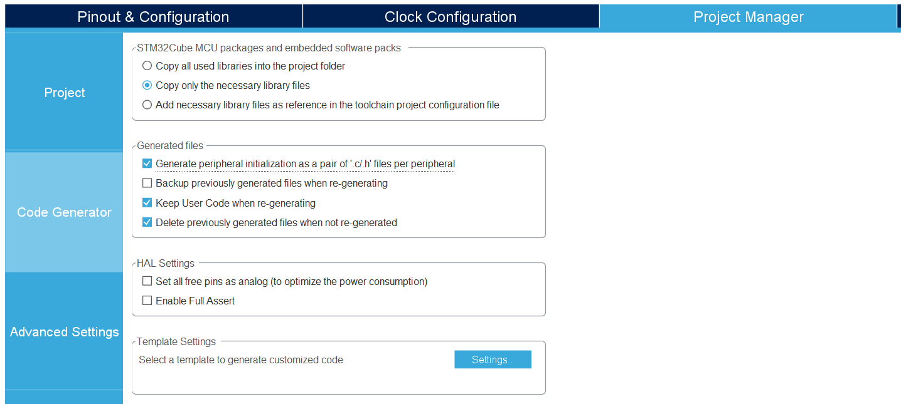
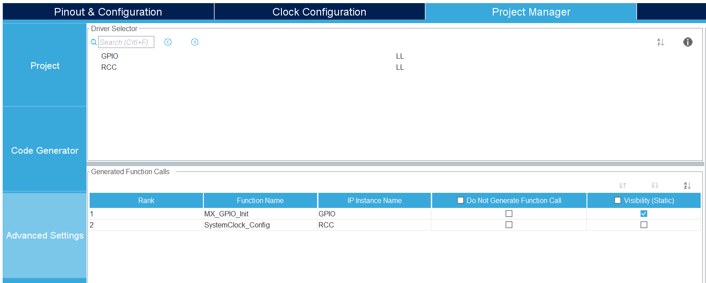
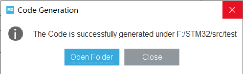

# 环境搭建

## 安装

- [Visual Studio Code](https://code.visualstudio.com/Download)

- [Python](https://www.python.org/downloads/)

- [Java jre](https://www.oracle.com/java/technologies/javase-downloads.html)

- [STM32CubeMX](https://www.st.com/zh/development-tools/stm32cubemx.html)

- [ST-Link-V2](https://www.st.com/zh/development-tools/st-link-v2.html#tools-software)

- [Make](http://gnuwin32.sourceforge.net/packages/make.htm)

- [OpenOCD](https://openocd.org/)

- [GNU Arm Embedded Toolchain](https://developer.arm.com/tools-and-software/open-source-software/developer-tools/gnu-toolchain/gnu-rm/downloads)

  推荐使用 [msys2](https://msys2.org) 安装工具链

    ```bash
    pacman -S mingw-w64-x86_64-openocd
    pacman -S mingw-w64-x86_64-make
    pacman -S mingw-w64-x86_64-arm-none-eabi-toolchain
    ```

> 不要忘记将工具链加入系统环境变量

## 配置

### STM32CubeMX

- `File` -> `New Project`


- 选择匹配的芯片，点击`Start Project`


- `Project Manager` -> `Project`，<br>设置`Project Name`和`Project Location`，<br>将`Application Structure`修改为`Basic`，<br>将`Toolchain/IDE`修改为`Makefile`，<br>勾选`Use latest available version`


- `Project Manager` -> `Code Generator`，<br>`STM32Cube MCU packages and embedded software packs`选择`Copy only the necessary library files`，<br>`Generated files`勾选`Generate peripheral initialization as a pair of '.c/.h' files per peripheral`



- `Project Manager` -> `Advanced Settings`，将`HAL`改为`LL`



- 点击`GENETATE CODE` -> `Open Folder`



### Visual Studio Code

- 右键通过`Code`打开


- 安装插件`Chinese (Simplified) Language`，`C/C++`，`C++ Intellisense`和`Cortex-Debug`


- 按`F1`键或者`ctrl+shift+P`，输入`编辑配置JSON`，然后选择下图选项


用以下内容替换原内容

```json
{
    "configurations": [
        {
            "name": "ARM",
            "includePath": [
                "${workspaceFolder}/**"
            ],
            "defines": [
                "USE_FULL_LL_DRIVER",
                "STM32F103xB"
            ],
            "cStandard": "gnu11",
            "cppStandard": "gnu++11",
            "compilerPath": "arm-none-eabi-gcc",
            "intelliSenseMode": "gcc-arm"
        }
    ],
    "version": 4
}
```

| 字符 | 解释 |
| :----: | :----: |
| `includePath` | 头文件路径 |
| `defines` | 宏定义 |
| `cStandard` | C标准 |
| `cppStandard` | C++标准 |
| `compilerPath` | 编译器路径 |
| `intelliSenseMode` | 智能感知模式 |

- 新建文件`openocd.cfg`，写入以下内容

```conf
source [find interface/stlink-v2.cfg]
source [find target/stm32f1x.cfg]
```

| 字符 | 解释 |
| :----: | :----: |
| `interface` | 调试器 |
| `target` | 目标板 |

- `运行` -> `添加配置` -> `Cortex Debug`或者按下图操作
    

```json
{
    "version": "0.2.0",
    "configurations": [
        {
            "cwd": "${workspaceRoot}",
            "executable": "./build/ELFNAME.elf",
            "name": "Debug",
            "request": "launch",
            "type": "cortex-debug",
            "servertype": "openocd",
            "configFiles": [
                "./openocd.cfg"
            ],
            "preLaunchTask": "Build",
            "postDebugTask": "Reset"
        }
    ]
}
```

| 字符 | 解释 |
| :----: | :----: |
| `executable` | 工程的`elf`文件路径 |
| `servertype` | 调试应用 |
| `configFiles` | 配置文件路径 |
| `preLaunchTask` | 调试开始前运行的任务 |
| `postDebugTask` | 调试结束后运行的任务 |

- 打开`Makefile`文件，追加以下内容

```bash
flash:
	openocd -f ../openocd.cfg -c init -c halt -c "program $(BUILD_DIR)/$(TARGET).hex verify reset exit"
reset:
	openocd -f ../openocd.cfg -c init -c halt -c reset -c shutdown
```

- `终端` -> `配置任务`，用以下内容替换原内容

```json
{
    "version": "2.0.0",
    "tasks": [
        {
            "type": "shell",
            "label": "Build",
            "command": "make -j",
            "problemMatcher": [
                "$gcc"
            ],
            "group": "build",
        },
        {
            "type": "shell",
            "label": "Flash",
            "command": "make -j;make flash",
            "problemMatcher": [
                "$gcc"
            ],
            "group": "build",
        },
        {
            "type": "shell",
            "label": "Reset",
            "command": "make reset",
            "problemMatcher": [
                "$gcc"
            ],
            "group": "build",
        },
    ]
}
```

`终端` -> `运行任务`，会出现三个任务 `Build`、`Flash` 和 `Reset`

| 任务 | 解释 |
| :----: | :----: |
| `Build` | 构建工程 |
| `Flash` | 下载程序 |
| `Reset` | 复位单片机 |

- `` ctrl+` ``切换终端，输入以下命令

| 命令 | 解释 |
| :----: | :----: |
| `make` | 编译工程代码 |
| `make flash` | 将代码烧录进单片机 |
| `make reset` | 将单片机复位 |

- `Python` [脚本](https://github.com/tqfx/stm32f1/blob/master/stm32init.py)
